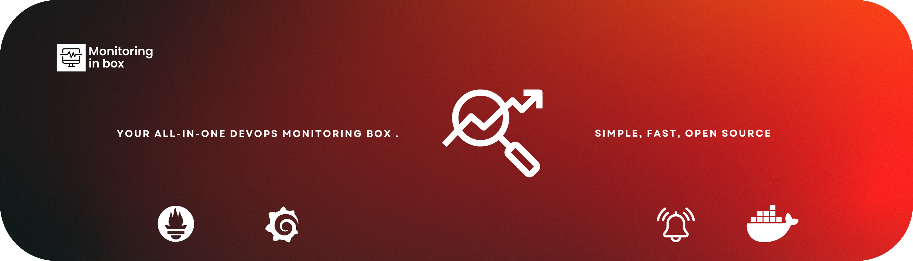
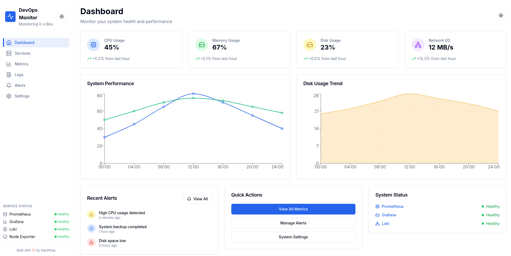
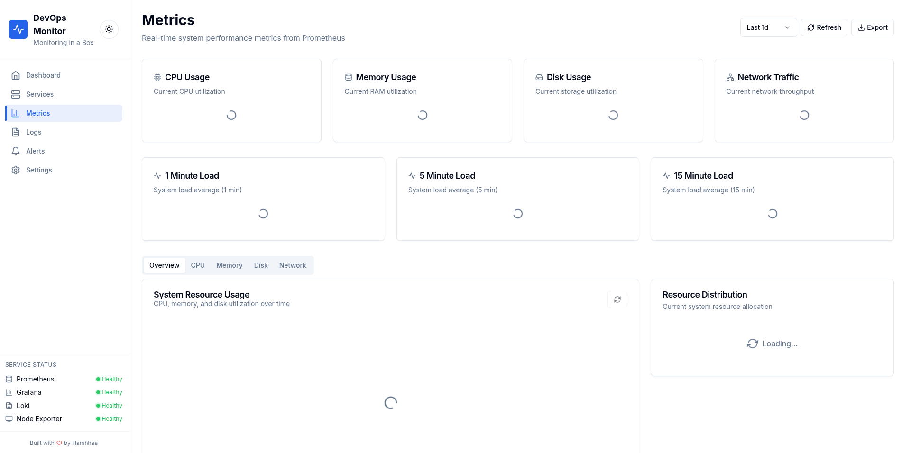
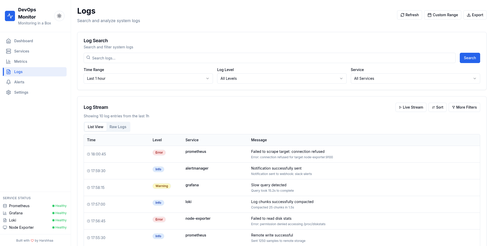
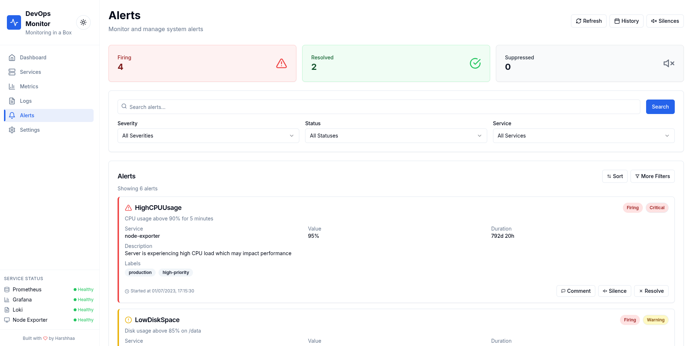
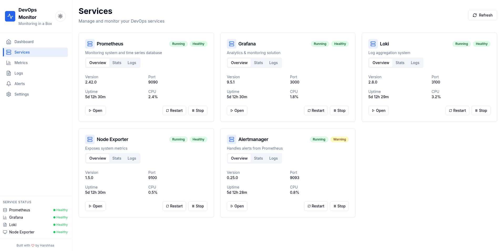
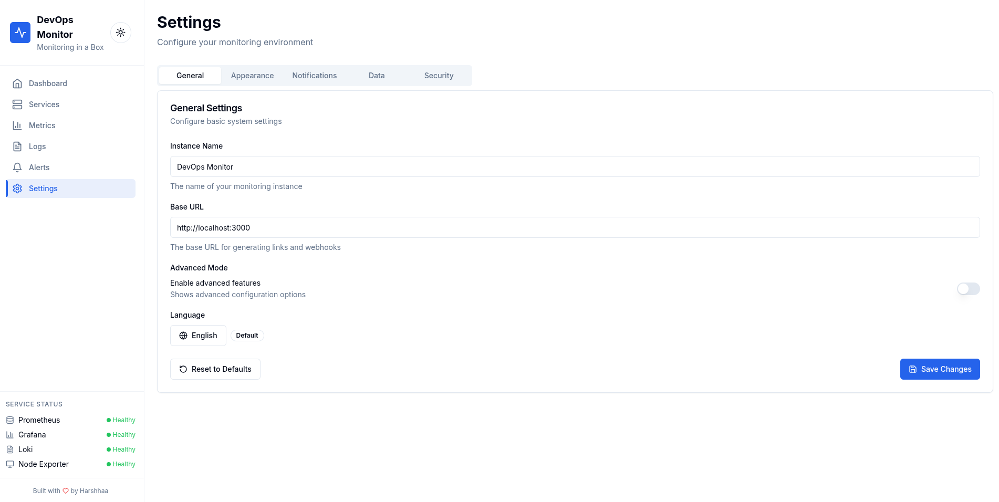
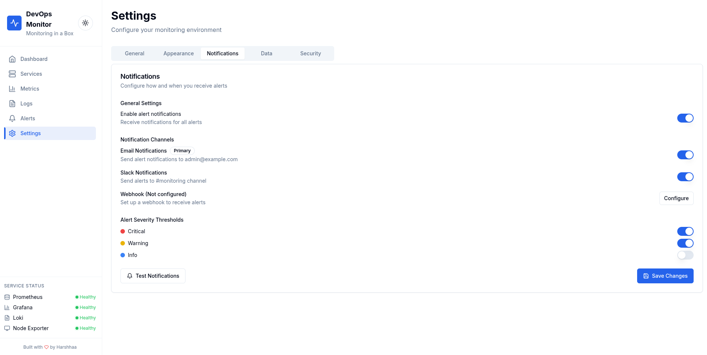
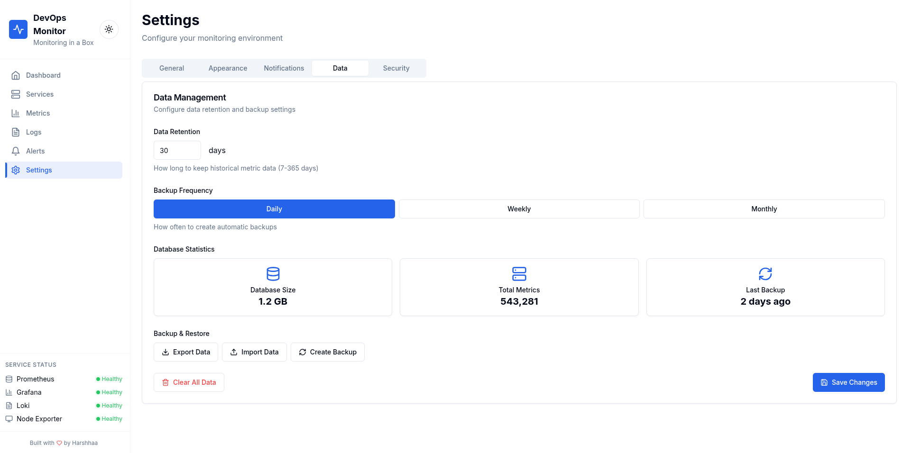
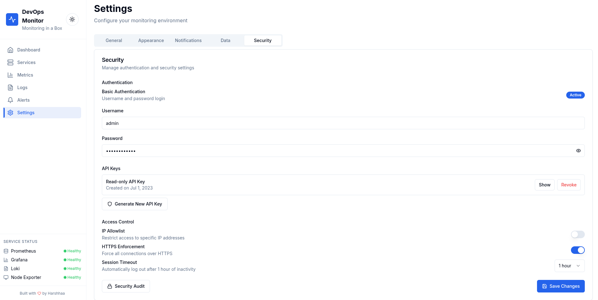

# 📦 DevOps Monitoring in a Box

<p align="center">
  
</p>

## 🚀 Overview

This project provides a **ready-to-use monitoring stack** for DevOps engineers and beginners.
With just **one command**, you get:

> **🎯 Demo Preview Available**: Check out the live demo at [devops-monitoring-in-a-box.vercel.app](https://devops-monitoring-in-a-box.vercel.app)  
> **Login**: demo@example.com / demo123 (Demo credentials only - configure your own for production)

* **Prometheus** → Metrics collection
* **Grafana** → Beautiful dashboards
* **Loki** → Centralized log aggregation
* **Alertmanager** → Alerts via Slack/Email/Webhooks
* **Node Exporter** → System metrics (CPU, RAM, Disk, etc.)
* **🔔 Notification Service** → Multi-channel notifications (Slack, Teams, Discord, Email, Webhooks)
* **🎨 Modern React UI** → **Unified dashboard experience** (What makes us unique!)

👉 Perfect for learning, testing, or quick local monitoring setup.

**🚀 What Sets Us Apart:** While most monitoring projects stop at Prometheus + Grafana, we provide a **modern, responsive web interface** that unifies all your monitoring tools into one beautiful dashboard experience!

## 🖼️ Visual Showcase

See what you'll get with our modern monitoring dashboard:

<table>
  <tr>
    <td align="center">
      <br/>
      <b>Main Dashboard</b><br/>
      <sub>Unified monitoring dashboard with system overview</sub>
    </td>
    <td align="center">
      <br/>
      <b>Metrics & Analytics</b><br/>
      <sub>Real-time metrics visualization and analysis</sub>
    </td>
  </tr>
  <tr>
    <td align="center">
      <br/>
      <b>Log Management</b><br/>
      <sub>Centralized log viewing and search</sub>
    </td>
    <td align="center">
      <br/>
      <b>Alert Management</b><br/>
      <sub>Comprehensive alert monitoring and management</sub>
    </td>
  </tr>
  <tr>
    <td align="center">
      <br/>
      <b>Service Monitoring</b><br/>
      <sub>Service health and status overview</sub>
    </td>
    <td align="center">
      <b>Settings & Configuration</b><br/>
      <div>
        
        <br/>
        
        <br/>
        
      </div>
      <sub>Comprehensive settings and configuration options</sub>
    </td>
  </tr>
</table>

*Comprehensive settings and configuration options for all monitoring aspects*

## ⚡ Quick Start

```bash
git clone https://github.com/<your-username>/devops-monitoring-in-a-box.git
cd devops-monitoring-in-a-box
docker-compose up -d
```

Then open:

* 🎨 **DevOps Monitor UI** → [http://localhost:4000](http://localhost:4000) - Modern unified dashboard
* Grafana → [http://localhost:3000](http://localhost:3000) (user: `admin`, pass: `admin`)
* Prometheus → [http://localhost:9090](http://localhost:9090)
* Loki → [http://localhost:3100](http://localhost:3100)
* Alertmanager → [http://localhost:9093](http://localhost:9093)

## 📂 Project Structure

The Monitoring in a Box project is organized into several key directories, each serving a specific purpose in the monitoring ecosystem.

### 🏗️ **Core Components**
- **`prometheus/`** - Metrics collection and alerting configuration
- **`grafana/`** - Dashboard and visualization setup
- **`loki/`** - Log aggregation and collection
- **`alertmanager/`** - Alert routing and notifications
- **`ui-next/`** - Modern Next.js web interface
- **`docs/`** - Comprehensive documentation
- **`exporters/`** - System metrics exporters

### 🎯 **Key Files**
- **`env.example`** - Environment variables template
- **`site-config.json`** - Site configuration (SEO, branding)
- **`config.json`** - Monitoring configuration
- **`docker-compose.yml`** - Production stack configuration
- **`devops-monitor.sh`** - Management script

### 📖 **Detailed Structure**
For a complete breakdown of all directories, files, and their purposes, see our comprehensive **[Project Structure Guide](docs/PROJECT_STRUCTURE.md)**.

## 📊 Features

### 🔧 Core Monitoring Stack
* 📈 **Metrics Collection**: Prometheus with Node Exporter for system metrics
* 🖼️ **Dashboards**: Pre-configured Grafana dashboards with beautiful visualizations
* 📜 **Log Aggregation**: Loki + Promtail for centralized log management
* 🚨 **Alert Management**: Alertmanager with multi-channel notifications
* 📊 **Service Health**: Real-time service status monitoring

### 🎨 Modern Web Interface
* 🖥️ **Unified Dashboard**: Single-page application for all monitoring needs
* 📱 **Responsive Design**: Works perfectly on desktop, tablet, and mobile
* 🌙 **Dark/Light Theme**: Automatic theme switching with user preference
* ⚡ **Real-time Updates**: Live data refresh without page reloads
* 🎯 **Intuitive Navigation**: Easy-to-use sidebar navigation

### 🔐 Authentication & Security
* 👤 **User Authentication**: Secure login system with session management
* 🏢 **Multi-tenant Support**: Role-based access control (Admin, Editor, Viewer)
* 🔒 **Secure API**: Protected endpoints with authentication middleware
* 🛡️ **Input Validation**: Comprehensive data validation and sanitization

### 📊 Advanced Monitoring Features
* 📈 **Custom Metrics**: Define and monitor custom application metrics
* 📊 **Dynamic Dashboards**: Create and customize monitoring dashboards
* 🔍 **Log Search**: Advanced log filtering and search capabilities
* 📊 **Metrics Visualization**: Interactive charts and graphs
* ⏰ **Historical Data**: Time-series data analysis and trending

### 🔔 Notification System
* 📧 **Email Alerts**: SMTP-based email notifications
* 💬 **Slack Integration**: Direct Slack channel notifications
* 🎯 **Microsoft Teams**: Teams webhook integration
* 🎮 **Discord Support**: Discord webhook notifications
* 🔗 **Custom Webhooks**: Generic webhook support for any service

### ⚙️ Configuration Management
* 🎛️ **Dynamic Configuration**: JSON-based configuration system
* 🔄 **Hot Reloading**: Configuration changes without restart
* 📁 **Import/Export**: Share configurations between environments
* ✅ **Validation**: Built-in configuration validation
* 🎨 **Site Customization**: SEO, branding, and company information

### 🔌 Plugin System
* 🧩 **Extensible Architecture**: Plugin-based system for custom integrations
* 📦 **Plugin Marketplace**: Browse and install community plugins
* ⚙️ **Plugin Configuration**: Easy plugin setup and management
* 🔧 **Custom Plugins**: Create your own monitoring plugins

### 📚 Documentation & Support
* 📖 **Comprehensive Docs**: Detailed documentation for all features
* 🎯 **Quick Start Guide**: Get up and running in minutes
* 🔧 **Configuration Examples**: Ready-to-use configuration templates
* 💡 **Best Practices**: Industry-standard monitoring practices

## ⚙️ Configuration

Configure your Monitoring in a Box platform with comprehensive environment variables and configuration files.

### 🔧 Quick Setup
1. **Copy example configuration**:
   ```bash
   cp env.example .env
   ```

2. **Edit your settings**:
   ```bash
   nano .env
   ```

3. **Start the platform**:
   ```bash
   docker-compose up -d
   ```

### 📖 Complete Configuration Guide
For detailed configuration options, environment variables, and deployment settings, see our comprehensive **[Configuration Guide](docs/CONFIGURATION_GUIDE.md)**.

**Key Configuration Areas:**
- 🌐 **Site Configuration**: SEO, branding, company information
- 🔐 **Authentication & Security**: Database, sessions, JWT tokens
- 📊 **Monitoring Services**: Prometheus, Grafana, Loki, Alertmanager
- 🔔 **Notifications**: Email, Slack, Teams, Discord, webhooks
- 🎨 **UI Settings**: Themes, dashboards, logs configuration
- 🔌 **Plugin System**: Plugin management and marketplace
- 🏢 **Multi-tenancy**: Tenant isolation and management
- 🚀 **Deployment**: Docker, Kubernetes, production settings

## 🔧 Next Steps (for contributors)

* Add more exporters (MySQL, Redis, Nginx, etc.)
* Add Kubernetes manifests for K8s-based deployment
* Add Terraform/Ansible automation for cloud deployment

## 🚀 Getting Started

📖 **For detailed setup instructions, see [SETUP.md](SETUP.md)**

### 🎯 Quick Commands

We've created convenient scripts to manage your entire monitoring stack:

```bash
# Start everything (monitoring stack + UI)
./devops-monitor.sh start

# Start just the UI development server
./devops-monitor.sh ui

# Check project status
./devops-monitor.sh status

# View service logs
./devops-monitor.sh logs

# Stop everything
./devops-monitor.sh stop

# Get help
./devops-monitor.sh help
```

### Prerequisites

* Docker and Docker Compose installed
* At least 2GB of available RAM
* Ports 3000, 9090, 3100, 9093 available

### Installation

1. **Clone the repository:**

   ```bash
   git clone https://github.com/<your-username>/devops-monitoring-in-a-box.git
   cd devops-monitoring-in-a-box
   ```

2. **Start the monitoring stack:**

   ```bash
   # Option 1: Using the management script (Recommended)
   ./devops-monitor.sh start
   
   # Option 2: Using Docker Compose directly
   docker-compose up -d
   ```

3. **Verify all services are running:**

   ```bash
   docker-compose ps
   ```

4. **Access the services:**
   * **Grafana**: <http://localhost:3000> (admin/admin)
   * **Prometheus**: <http://localhost:9090>
   * **Loki**: <http://localhost:3100>
   * **Alertmanager**: <http://localhost:9093>

### Stopping the Stack

```bash
docker-compose down
```

### Viewing Logs

```bash
# All services
docker-compose logs

# Specific service
docker-compose logs prometheus
docker-compose logs grafana
```

## 📈 What You'll Get

### Prometheus

* Scrapes metrics from Node Exporter every 15 seconds
* Stores time-series data for historical analysis
* Built-in query language (PromQL) for data exploration

### Grafana

* Pre-configured Prometheus data source
* Node Exporter dashboard showing system metrics
* Easy to create custom dashboards and alerts

### Loki

* Collects logs from various sources
* Efficient log storage and querying
* Integration with Grafana for log visualization

### Alertmanager

* Sample alert rules for system monitoring
* Ready for Slack/Email/Webhook integration
* Manages alert routing and silencing

### Node Exporter

* Exports system metrics (CPU, memory, disk, network)
* Low resource footprint
* Industry standard for system monitoring

## 📚 Documentation

**📖 [Complete Documentation](docs/README.md)** - Comprehensive guides and setup instructions

### Key Documentation Links:
- **[Setup Guide](docs/SETUP.md)** - Detailed setup instructions
- **[Configuration Guide](docs/CONFIGURATION_GUIDE.md)** - Complete configuration reference
- **[Project Structure](docs/PROJECT_STRUCTURE.md)** - Complete project structure overview
- **[Prometheus Integration](docs/PROMETHEUS_INTEGRATION.md)** - Metrics collection and configuration
- **[Grafana Dashboards](docs/PROMETHEUS_INTEGRATION.md#grafana-dashboards)** - Dashboard setup and customization
- **[Loki Logs](docs/LOKI_INTEGRATION.md)** - Log aggregation and search
- **[AlertManager](docs/ALERTMANAGER_INTEGRATION.md)** - Alert management and notifications
- **[Authentication & Multi-Tenancy](docs/AUTHENTICATION_MULTI_TENANCY_GUIDE.md)** - User management and role-based access
- **[UI Application](docs/UI_README.md)** - Next.js web interface documentation
- **[Configuration System](docs/CONFIG_SYSTEM_GUIDE.md)** - Dynamic configuration management
- **[Service Health](docs/SERVICE_HEALTH_GUIDE.md)** - Health monitoring and status checks
- **[UX Improvements](docs/UX_IMPROVEMENTS_GUIDE.md)** - User interface enhancements
- **[Plugin System](docs/PLUGIN_SYSTEM_GUIDE.md)** - Plugin development and management
- **[Dashboard Templates](docs/DASHBOARD_TEMPLATE_MANAGEMENT_GUIDE.md)** - Template creation and marketplace
- **[Notifications Integration](docs/NOTIFICATIONS_INTEGRATION.md)** - Multi-channel notification setup
- **[Production Setup](docs/PRODUCTION_SETUP.md)** - Production deployment guide

### 🎯 Quick Access
- **Main Documentation Hub**: [docs/README.md](docs/README.md)
- **All Documentation Files**: [docs/](docs/) folder

## 🔒 Security Notes

* Default credentials are for development only
* Change default passwords in production
* Consider using secrets management for sensitive configs
* Restrict network access in production environments

## 🤝 Contributing

1. Fork the repository
2. Create a feature branch
3. Make your changes
4. Add tests if applicable
5. Submit a pull request

## 📝 License

This project is licensed under the MIT License - see the [LICENSE](LICENSE) file for details.

## 🙏 Acknowledgments

* [Prometheus](https://prometheus.io/) - Metrics collection
* [Grafana](https://grafana.com/) - Visualization platform
* [Loki](https://grafana.com/oss/loki/) - Log aggregation
* [Node Exporter](https://github.com/prometheus/node_exporter) - System metrics

---

## 🛠️ Author & Community

Built with passion and purpose by [**Harshhaa**](https://github.com/NotHarshhaa).  
Your ideas, feedback, and contributions are what make this project better.

Let’s shape the future of DevOps monitoring together! 🚀

**Connect & Collaborate:**  

* **GitHub:** [@NotHarshhaa](https://github.com/NotHarshhaa)  
* **Blog:** [ProDevOpsGuy](https://blog.prodevopsguy.xyz)  
* **Telegram Community:** [Join Here](https://t.me/prodevopsguy)  
* **LinkedIn:** [Harshhaa Vardhan Reddy](https://www.linkedin.com/in/harshhaa-vardhan-reddy/)  

---

## ⭐ How You Can Support

If you found this project useful:  

* ⭐ **Star** the repository to show your support  
* 📢 **Share** it with your friends and colleagues  
* 📝 **Open issues** or **submit pull requests** to help improve it

---

### 📢 Stay Connected

[](https://github.com/NotHarshhaa)

Join the community, share your experience, and help us grow!
