# 📦 DevOps Monitoring in a Box

<p align="center">
  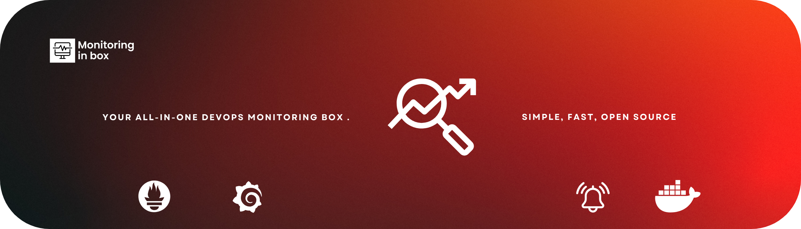
</p>

<p align="center">
  <a href="https://hub.docker.com/r/harshhaareddy/devops-monitoring-box"></a>
  <a href="https://devops-monitoring-in-a-box.vercel.app"></a>
  <a href="#license"></a>
</p>

## 🚀 Overview

This project provides a **complete, production-grade monitoring stack** for DevOps engineers, SREs, and beginners.
With just **one command**, you get:

> **🎯 Demo Preview Available**: Check out the live demo at [devops-monitoring-in-a-box.vercel.app](https://devops-monitoring-in-a-box.vercel.app)  
> **Login**: demo@example.com / demo123 (Demo credentials only - configure your own for production)

* 📈 **Prometheus** → High-performance metrics collection and alerting engine
* 📊 **Grafana** → Beautiful dashboards with pre-provisioned datasources and views
* 📜 **Loki** → Centralized log aggregation and stream querying
* 🚨 **Alertmanager** → Multi-channel notification router (Slack, Teams, Discord, Email, Webhooks)
* 🖥️ **Node Exporter** → Real-time host and system metrics (CPU, RAM, Disk, Load, Network)
* 🐳 **cAdvisor** → Container CPU, memory, and lifecycle resource monitoring
* 🛰️ **Blackbox Exporter** → Synthetic HTTP/HTTPS, TCP, DNS, and ICMP uptime probing
* 🔒 **SSL/TLS Certificate Tracker** → Domain certificate expiration, validity days, and SAN inspector
* ⏱️ **SLI/SLA Availability Engine** → 99.9% / 99.99% uptime heatmaps and MTTR tracking
* 🔔 **Multi-Channel Notification Service** → Automated webhook dispatching and masking
* 🎨 **Radix-Sera Unified UI** → Modern Next.js 16 web interface styled with shadcn UI and Hugeicons

👉 Perfect for learning, testing, local homelabs, or full production deployments.

**🚀 What Sets Us Apart:** While most monitoring projects stop at Prometheus + Grafana, we provide a **modern, responsive web interface** that unifies all your monitoring tools into one seamless dashboard experience!

---

## ✨ New & Highlighted Features

### 🎨 1. Modern Radix-Sera Design System
- **shadcn UI with Sera Preset**: Clean, high-contrast aesthetics with seamless Dark/Light mode switching.
- **Hugeicons Integration**: Crisp, accessible stroke icons replacing bulky legacy icon sets.
- **Micro-animations**: Smooth Framer Motion transitions across dashboard widgets, metrics cards, and log inspectors.

### 🔒 2. SSL/TLS Certificate Expiration & Health Tracker
- **Real-time Probing**: Live SSL/TLS inspection via `/api/ssl` for any public or internal domain.
- **Early Expiry Warnings**: Color-coded badges for Valid (>30d), Warning (14-30d), and Critical/Expired (<14d).
- **Certificate Metadata**: Displays Certificate Authority (Issuer CA), Subject, Validity ranges, Serial Numbers, and Subject Alternative Names (SANs).

### ⏱️ 3. SLI / SLA Availability & Outage Tracker
- **Uptime Heatmaps**: Interactive 30-day timeline bars showing daily uptime percentages.
- **Key Reliability Metrics**: Mean Time to Recovery (MTTR), 24h/7d/30d availability SLAs, and active outage counters.
- **Synthetics Integration**: Automatically correlates with Prometheus Blackbox Exporter probe results.

### 🔕 4. Alertmanager Quick Silence Management
- **One-Click Silences**: Create 1h, 2h, 4h, or 24h silences directly from the alert cards.
- **Inhibitor Rules**: Pre-configured alert inhibition prevents alert fatigue when root hosts go down.

### 🛡️ 5. Zero-Vulnerability Hardened Docker Container
- **Docker Scout Verified**: Clean scan with **0 Critical CVEs**.
- **Process Supervision (`tini`)**: Proper PID 1 signal forwarding (`SIGTERM`/`SIGINT`) and zombie reaping.
- **Least-Privilege Execution**: Runs under a dedicated non-root `nextjs` user with secured `.next/cache` permissions.

---

## 🖼️ Visual Showcase

<table>
  <tr>
    <td align="center">
      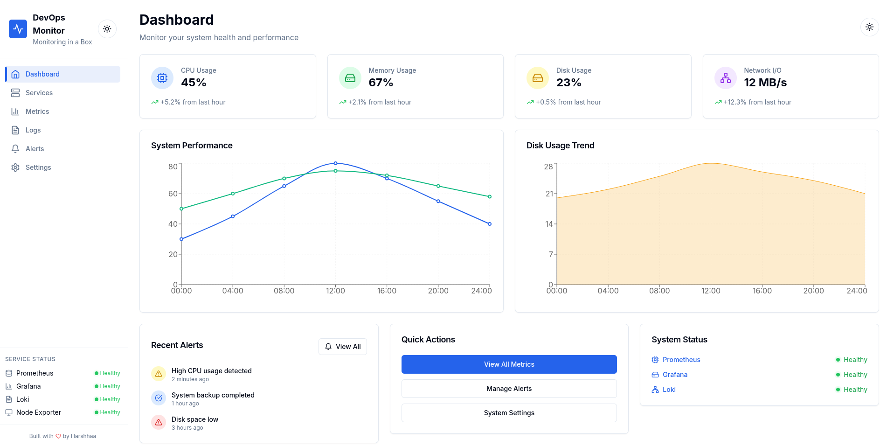<br/>
      <b>Main Dashboard</b><br/>
      <sub>Unified monitoring dashboard with system overview</sub>
    </td>
    <td align="center">
      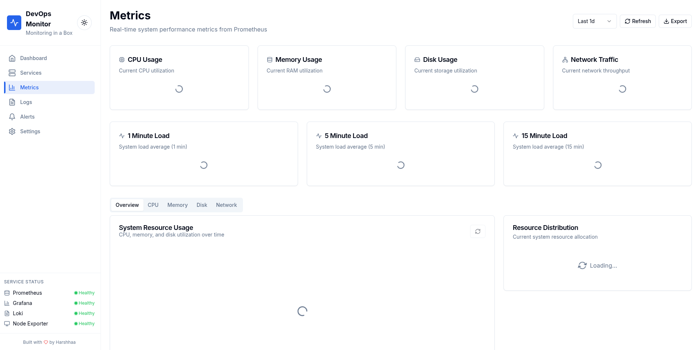<br/>
      <b>Metrics & Analytics</b><br/>
      <sub>Real-time metrics visualization and PromQL analysis</sub>
    </td>
  </tr>
  <tr>
    <td align="center">
      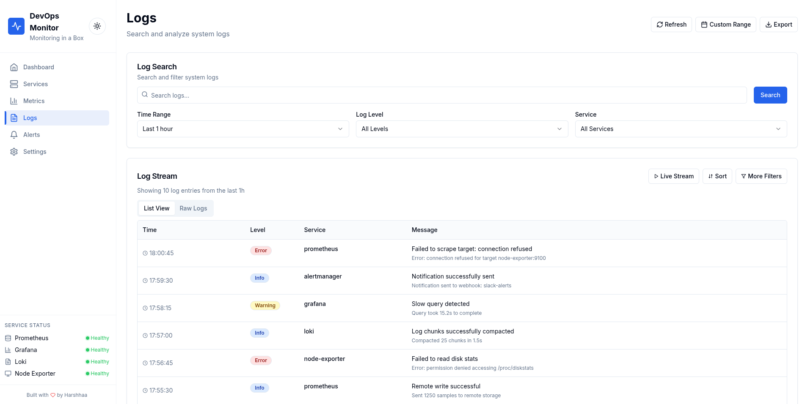<br/>
      <b>Log Management</b><br/>
      <sub>Centralized Loki log viewing and search</sub>
    </td>
    <td align="center">
      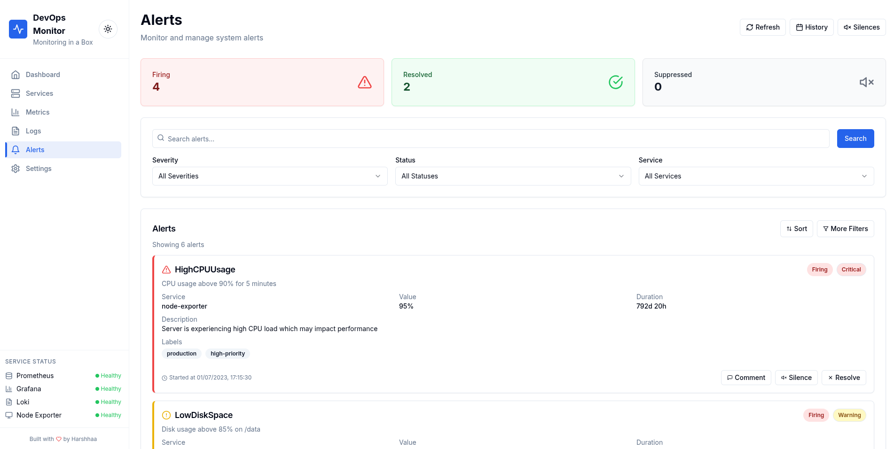<br/>
      <b>Alert Management</b><br/>
      <sub>Comprehensive alert routing and 1-click silencing</sub>
    </td>
  </tr>
  <tr>
    <td align="center">
      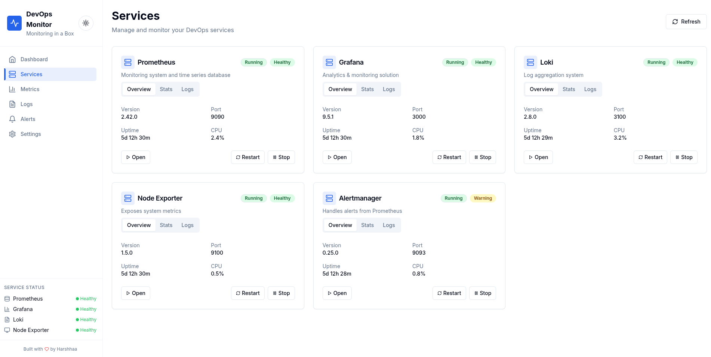<br/>
      <b>Services & SLA & SSL Tracker</b><br/>
      <sub>Health checks, 30-day uptime SLA, and certificate monitoring</sub>
    </td>
    <td align="center">
      <b>Settings & Configuration</b><br/>
      <div>
        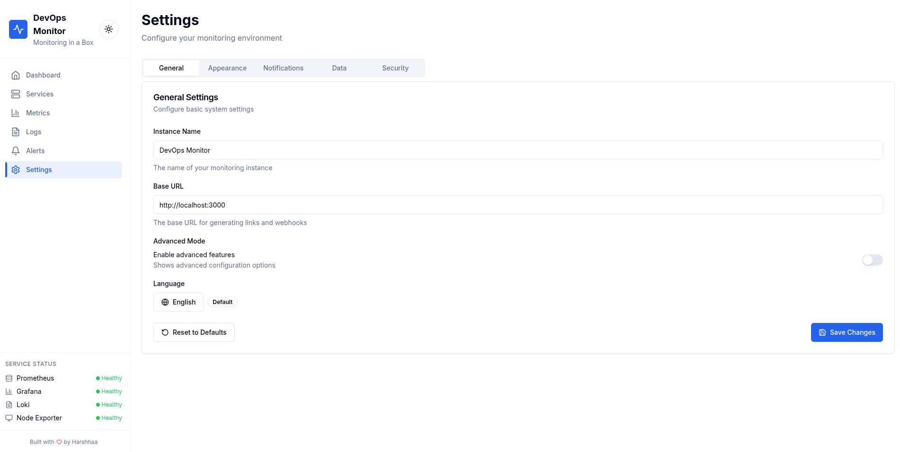
        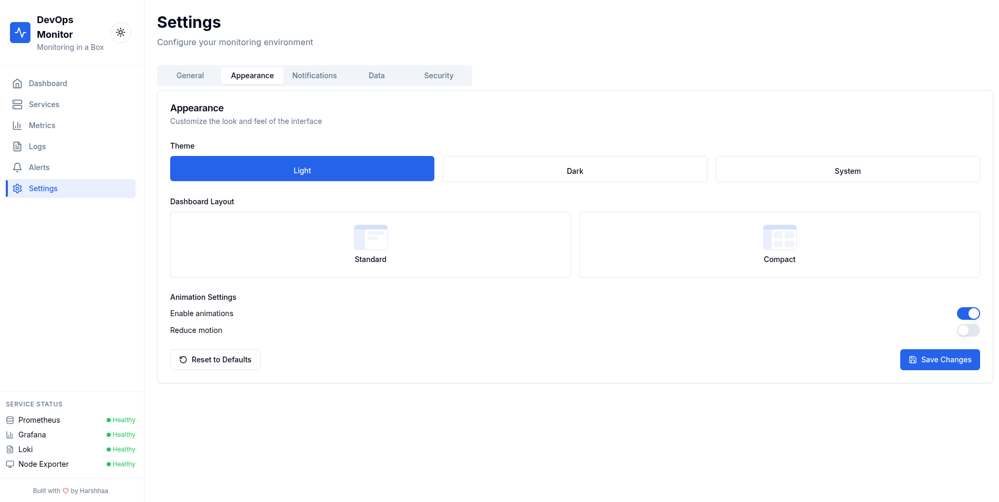<br/>
        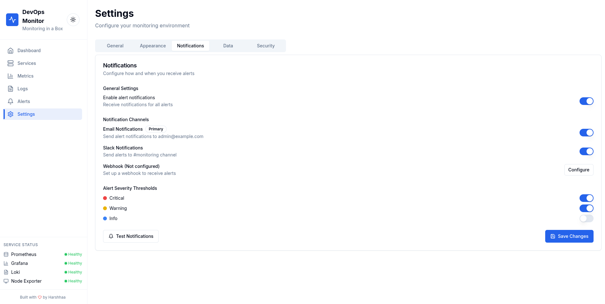
        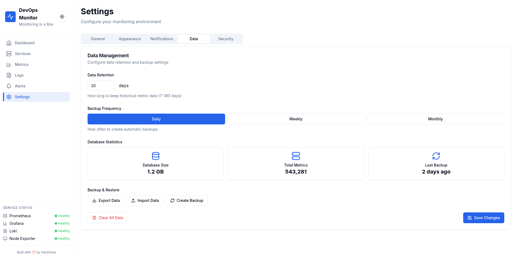<br/>
        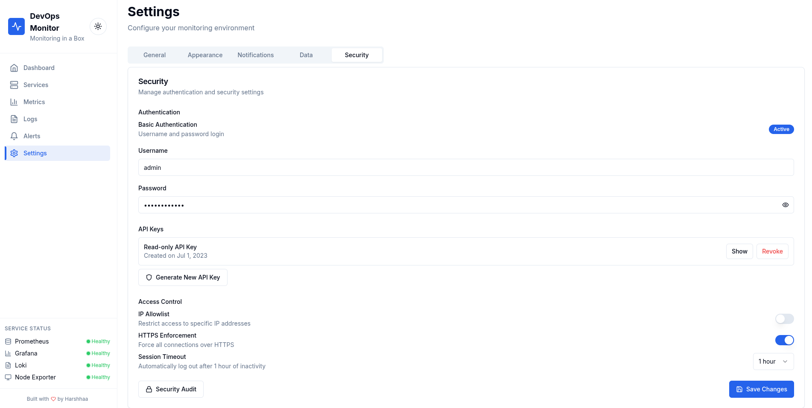
      </div>
      <sub>Comprehensive notification channels and multi-tenant settings</sub>
    </td>
  </tr>
</table>

---

## 🚀 Usage & Deployment

Choose your preferred deployment method based on your needs:

### 🐳 **Docker Deployment (Recommended)**

#### **Option 1: Quick Start with Docker Compose (Full Stack)**
```bash
# Clone the repository
git clone https://github.com/NotHarshhaa/devops-monitoring-in-a-box.git
cd devops-monitoring-in-a-box

# Generate secure secrets (.env and Alertmanager token)
./scripts/setup-env.sh

# Start the complete monitoring stack
docker compose up -d
```

#### **Option 2: Native PowerShell (Windows)**
```powershell
.\scripts\devops-monitor.ps1 init-env    # generate .env with strong secrets
.\scripts\devops-monitor.ps1 start       # start the stack
.\scripts\devops-monitor.ps1 status      # containers + dashboard health
.\scripts\devops-monitor.ps1 health      # probe every published endpoint
.\scripts\devops-monitor.ps1 logs -Service prometheus
.\scripts\devops-monitor.ps1 validate    # promtool + amtool + compose config
.\scripts\devops-monitor.ps1 verify      # lint, type-check, tests, build
.\scripts\devops-monitor.ps1 clean       # remove containers and volumes
```

#### **Option 3: Pre-built Docker Image**
```bash
docker pull harshhaareddy/devops-monitoring-box:latest
docker run -d -p 4000:3000 --name devops-monitor harshhaareddy/devops-monitoring-box:latest
```

---

### 🌐 **Cloud Deployment**

#### **Vercel (Frontend Only)**
[](https://vercel.com/new/clone?repository-url=https://github.com/NotHarshhaa/devops-monitoring-in-a-box)

```bash
# Deploy the UI to Vercel
cd ui-next
npm install
vercel --prod
```

#### **Netlify (Frontend Only)**
[](https://app.netlify.com/start/deploy?repository=https://github.com/NotHarshhaa/devops-monitoring-in-a-box)

```bash
# Build and deploy to Netlify
cd ui-next
npm install
npm run build
```

#### **Railway (Full Stack)**
[](https://railway.app/template/your-template-id)

```bash
# Deploy full stack to Railway
railway login
railway init
railway up
```

---

## 🎯 Access Points

Once deployed, access your monitoring tools:

| Service | Port / URL | Credentials | Description |
|---------|------------|-------------|-------------|
| 🎨 **DevOps Monitor UI** | [http://localhost:4000](http://localhost:4000) | demo@example.com / demo123 | Unified observability web application |
| ❤️ **Health API** | [http://localhost:4000/api/health](http://localhost:4000/api/health) | - | Stack health, used by the container healthcheck |
| 📊 **Grafana** | [http://localhost:3000](http://localhost:3000) | `admin` / `admin` | Visualization dashboards with pre-provisioned datasources |
| 📈 **Prometheus** | [http://localhost:9090](http://localhost:9090) | - | Metrics collection & PromQL engine |
| 📜 **Loki** | [http://localhost:3100](http://localhost:3100) | - | Log aggregation and query service |
| 🚨 **Alertmanager** | [http://localhost:9093](http://localhost:9093) | - | Alert routing & silencing |
| 🛰️ **Blackbox Exporter** | [http://localhost:9115](http://localhost:9115) | - | HTTP/TCP uptime probing |
| 🖥️ **Node Exporter** | `http://localhost:9100/metrics` | - | Host kernel & hardware metrics |
| 🐳 **cAdvisor** | `http://localhost:8080/metrics` | - | Container performance metrics |

---

## 🔧 Management & CLI Helpers

| Bash Command (`./devops-monitor.sh`) | PowerShell (`.\scripts\devops-monitor.ps1`) | Purpose |
|-------------------------------------|--------------------------------------------|---------|
| `./devops-monitor.sh start` | `.\scripts\devops-monitor.ps1 start` | Start all stack containers |
| `./devops-monitor.sh status` | `.\scripts\devops-monitor.ps1 status` | Check service health & running state |
| `./devops-monitor.sh health` | `.\scripts\devops-monitor.ps1 health` | Probe all endpoints for 200 OK |
| `./devops-monitor.sh logs` | `.\scripts\devops-monitor.ps1 logs` | View unified logs across services |
| `./devops-monitor.sh stop` | `.\scripts\devops-monitor.ps1 stop` | Gracefully shut down all containers |
| `./devops-monitor.sh clean` | `.\scripts\devops-monitor.ps1 clean` | Remove containers and data volumes |

---

## 📂 Project Structure

### 🏗️ **Core Components**
- **`prometheus/`** - Metrics collection, alert rules, and `targets/` probe lists
- **`grafana/`** - Dashboard and visualization provisioning
- **`loki/`** - Log aggregation and collection configs
- **`alertmanager/`** - Alert routing, notification channels, and silencing
- **`ui-next/`** - Modern Next.js web application
- **`docs/`** - Comprehensive documentation
- **`exporters/`** - Exporter configuration (Blackbox uptime probing)

### 🎯 **Key Files**
- **`devops-monitor.sh`** - Main management script (Linux/macOS wrapper)
- **`scripts/devops-monitor.ps1`** - Native Windows PowerShell management script
- **`env.example`** - Environment variables template
- **`site-config.json`** - Site configuration (SEO, branding)
- **`config.json`** - Monitoring configuration
- **`docker-compose.yml`** - Production stack configuration
- **`prometheus/targets/*.yml`** - Uptime probe targets, hot-reloaded without restart

For a complete breakdown of all directories and files, see **[Project Structure Guide](docs/PROJECT_STRUCTURE.md)**.

---

## 📊 Feature Breakdown

### 🔧 Core Monitoring Stack
* 📈 **Metrics Collection**: Prometheus with Node Exporter for system metrics
* 🖼️ **Dashboards**: Pre-configured Grafana dashboards with beautiful visualizations
* 📜 **Log Aggregation**: Loki + Promtail for centralized log management
* 🚨 **Alert Management**: Alertmanager with multi-channel notifications
* 📊 **Service Health**: Real-time service status monitoring

### 🎨 Modern Web Interface
* 🖥️ **Unified Dashboard**: Single-page application for all monitoring needs
* 📱 **Responsive Design**: Works perfectly on desktop, tablet, and mobile
* 🌙 **Dark/Light Theme**: Automatic theme switching with user preference
* ⚡ **Real-time Updates**: Live data refresh without page reloads
* 🎯 **Intuitive Navigation**: Easy-to-use sidebar navigation

### 🔐 Authentication & Security
* 👤 **User Authentication**: Secure login system with session management
* 🏢 **Multi-tenant Support**: Role-based access control (Admin, Editor, Viewer)
* 🔒 **Secure API**: Protected endpoints with authentication middleware
* 🛡️ **Input Validation**: Comprehensive data validation and sanitization

### 🔔 Notification System
* 📧 **Email Alerts**: SMTP-based email notifications
* 💬 **Slack Integration**: Direct Slack channel notifications
* 🎯 **Microsoft Teams**: Teams webhook integration
* 🎮 **Discord Support**: Discord webhook notifications
* 🔗 **Custom Webhooks**: Generic webhook support for any service

---

## 🛰️ Synthetic Uptime & Dynamic Probing

The stack ships a **Blackbox Exporter** so you can watch any HTTP, HTTPS or TCP endpoint:

Add targets to `prometheus/targets/http-probes.yml` without restarting the stack:

```yaml
# prometheus/targets/http-probes.yml
- targets:
    - https://api.yourcompany.com/health
    - https://yourcompany.com
  labels:
    module: https_2xx     # probe module from exporters/blackbox/config.yml
    env: production       # any labels you add appear on the probe_* series
    team: platform
```

On Windows, the management script can add probes for you:

```powershell
.\scripts\devops-monitor.ps1 probe -Url https://my-app.example.com/health
```

Prometheus automatically hot-reloads probe target files every 30 seconds.

---

## 🔀 How the Dashboard Reaches the Backends

The browser never calls Prometheus, Loki or Alertmanager directly. It calls the dashboard, which forwards the request server-side:

```
browser ──▶ /api/proxy/prometheus/api/v1/query ──▶ http://prometheus:9090/api/v1/query
```

This matters for three reasons:

- **It works in Docker.** Container hostnames such as `prometheus:9090` cannot be resolved by a browser, so direct calls fail in any containerised deployment.
- **No CORS setup.** Requests are same-origin.
- **The backends can stay private.** You can remove the published `9090`, `3100` and `9093` ports entirely and the dashboard keeps working.

Every proxied request requires a signed-in user, and each upstream path is matched against an explicit allowlist (`ui-next/lib/server/upstream.ts`). Administrative endpoints — Prometheus' `admin/tsdb/delete_series`, Loki's `push` — are not reachable through the proxy.

---

## 📈 What You'll Get

### Prometheus
* Scrapes metrics from Node Exporter and cAdvisor every 15 seconds
* Stores time-series data for historical analysis
* Built-in query language (PromQL) for data exploration

### Grafana
* Pre-configured Prometheus and Loki data sources
* Node Exporter and container dashboards showing real-time metrics
* Custom alerts and dashboard templating

### Loki
* Collects logs from containers and system services
* Efficient log storage and querying
* Log-to-metric correlations in Grafana

### Alertmanager
* Production-ready alert rules for system, disk, and container alerts
* Slack/Email/Discord/Teams webhook routing
* Integrated silence management

### Node Exporter & cAdvisor
* Host CPU, memory, disk, network metrics
* Container memory working sets, CPU throttling, and OOM event tracking

---

## 📚 Documentation

**📖 [Complete Documentation Hub](docs/README.md)** - Comprehensive guides and setup instructions

### Key Documentation Links:
- **[Setup Guide](docs/SETUP.md)** - Detailed setup instructions
- **[Configuration Guide](docs/CONFIGURATION_GUIDE.md)** - Complete configuration reference
- **[Project Structure](docs/PROJECT_STRUCTURE.md)** - Complete project structure overview
- **[Prometheus Integration](docs/PROMETHEUS_INTEGRATION.md)** - Metrics collection and configuration
- **[Grafana Dashboards](docs/PROMETHEUS_INTEGRATION.md#grafana-dashboards)** - Dashboard setup and customization
- **[Loki Logs](docs/LOKI_INTEGRATION.md)** - Log aggregation and search
- **[AlertManager](docs/ALERTMANAGER_INTEGRATION.md)** - Alert management and notifications
- **[Authentication & Multi-Tenancy](docs/AUTHENTICATION_MULTI_TENANCY_GUIDE.md)** - User management and role-based access
- **[UI Application](docs/UI_README.md)** - Next.js web interface documentation
- **[Configuration System](docs/CONFIG_SYSTEM_GUIDE.md)** - Dynamic configuration management
- **[Service Health](docs/SERVICE_HEALTH_GUIDE.md)** - Health monitoring and status checks
- **[UX Improvements](docs/UX_IMPROVEMENTS_GUIDE.md)** - User interface enhancements
- **[Plugin System](docs/PLUGIN_SYSTEM_GUIDE.md)** - Plugin development and management
- **[Dashboard Templates](docs/DASHBOARD_TEMPLATE_MANAGEMENT_GUIDE.md)** - Template creation and marketplace
- **[Notifications Integration](docs/NOTIFICATIONS_INTEGRATION.md)** - Multi-channel notification setup
- **[Production Setup](docs/PRODUCTION_SETUP.md)** - Production deployment guide

---

## 🔒 Security Notes

* `NEXTAUTH_SECRET` and `ALERT_WEBHOOK_TOKEN` are **required** — Compose fails rather than accepting a shared/default signing key or an unauthenticated Alertmanager webhook. Generate both and the matching `alertmanager/webhook_token` file with `./scripts/setup-env.sh` or `.\scripts\devops-monitor.ps1 init-env`.
* Change default Grafana credentials before exposing the stack in production.
* Prometheus admin API (`--web.enable-admin-api`) is disabled by default.
* `/api/notifications` never returns plain SMTP passwords or channel webhook URLs in client payloads; they are masked, and saving preserves stored secrets.
* Published ports `9090`, `3100`, `9093`, and `9115` are optional for convenience. The dashboard proxies internal traffic via Docker networks, so external ports can be removed in hardened environments.

---

## 🤝 Contributing

1. Fork the repository (`git clone https://github.com/NotHarshhaa/devops-monitoring-in-a-box.git`)
2. Create a feature branch (`git checkout -b feature/awesome-feature`)
3. Commit your changes (`git commit -m 'Add awesome feature'`)
4. Push to the branch (`git push origin feature/awesome-feature`)
5. Open a Pull Request

---

## 📝 License

This project is licensed under the **MIT License** - see the [LICENSE](LICENSE) file for details.

---

## 🙏 Acknowledgments

* [Prometheus](https://prometheus.io/) - Metrics collection
* [Grafana](https://grafana.com/) - Visualization platform
* [Loki](https://grafana.com/oss/loki/) - Log aggregation
* [Node Exporter](https://github.com/prometheus/node_exporter) - System metrics

---

## 🛠️ Author & Community

Built with passion and purpose by [**Harshhaa**](https://github.com/NotHarshhaa).  
Your ideas, feedback, and contributions are what make this project better.

Let’s shape the future of DevOps monitoring together! 🚀

**Connect & Collaborate:**  

* **GitHub:** [@NotHarshhaa](https://github.com/NotHarshhaa)  
* **Blog:** [ProDevOpsGuy](https://blog.prodevopsguy.xyz)  
* **Telegram Community:** [Join Here](https://t.me/prodevopsguy)  
* **LinkedIn:** [Harshhaa Vardhan Reddy](https://www.linkedin.com/in/harshhaa-vardhan-reddy/)  

---

## ⭐ How You Can Support

If you found this project useful:  

* ⭐ **Star** the repository to show your support  
* 📢 **Share** it with your friends and colleagues  
* 📝 **Open issues** or **submit pull requests** to help improve it

---

### 📢 Stay Connected

[](https://github.com/NotHarshhaa)

Join the community, share your experience, and help us grow!
